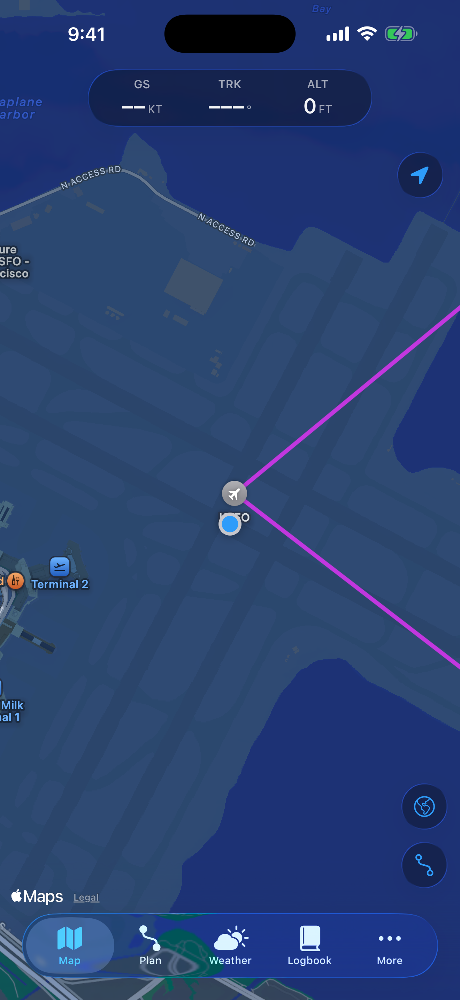
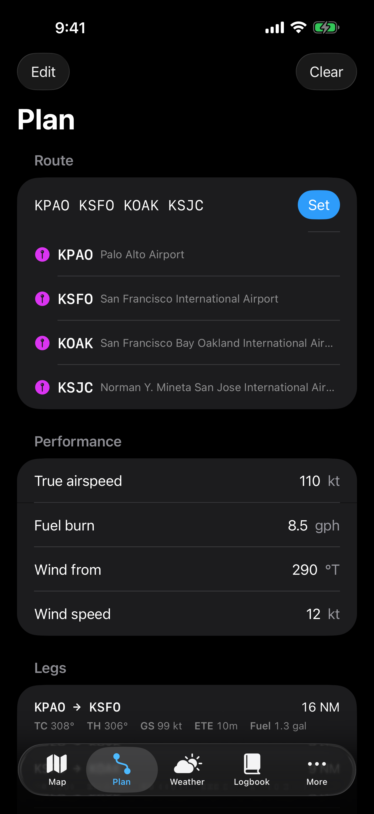
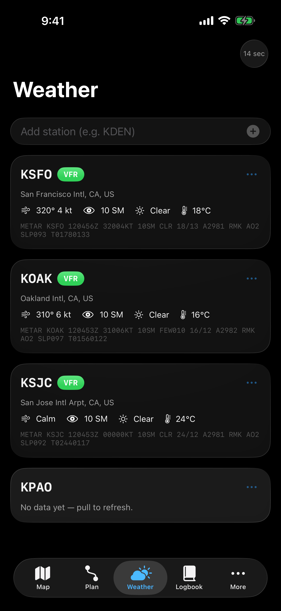
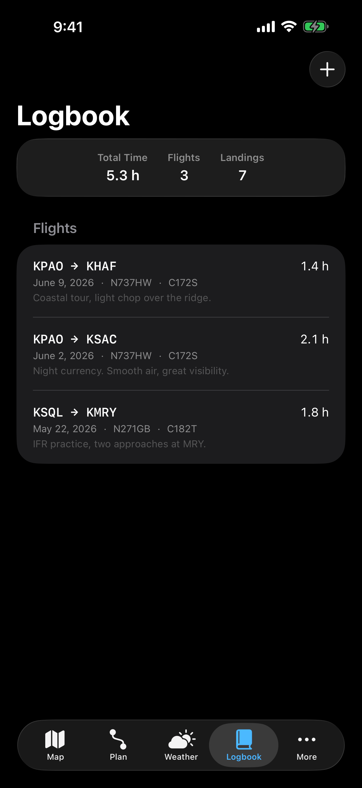
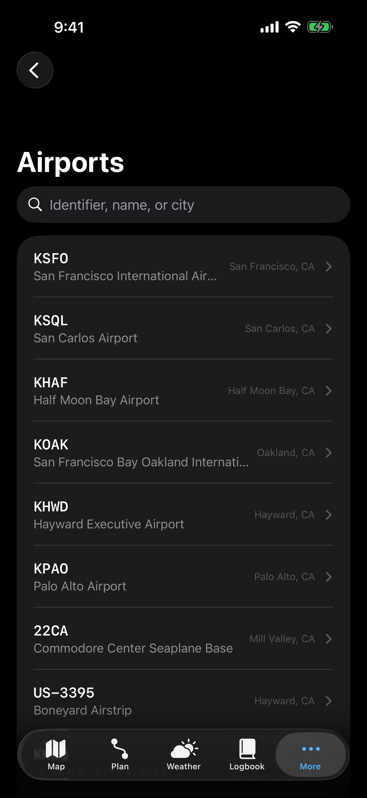
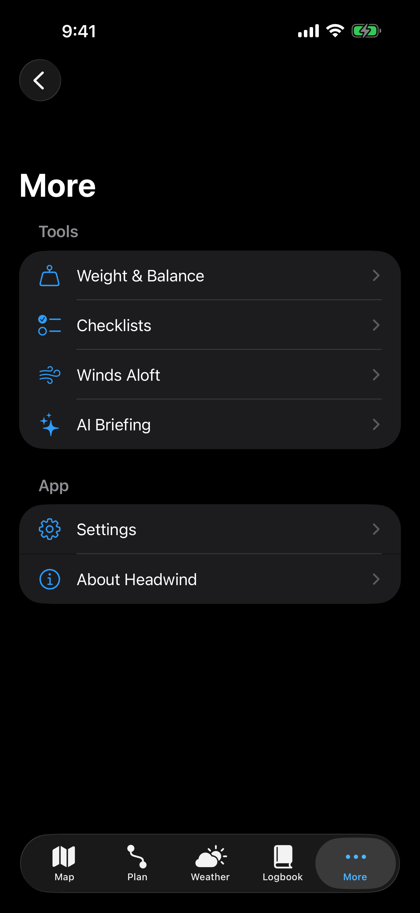

# Headwind ✈️

**Free, modern flight planning for iOS and iPadOS.**

Headwind is an open-source electronic flight bag (EFB) built for general-aviation
pilots — moving map, live weather, route planning, weight & balance, checklists,
and a digital logbook — with no subscription, in a design built natively on
Apple's newest platform technologies:

- **Liquid Glass** design system (iOS 26): floating glass instrument strips,
  map controls, and cards throughout.
- **Apple Intelligence** (FoundationModels): on-device AI weather briefings
  grounded in live METAR data, with a deterministic fallback on every device.
- **SwiftUI + MapKit + Swift Charts + SwiftData**, end to end.

> ⚠️ **Headwind is not certified for navigation.** It is not a substitute for
> official charts, weather briefings, or NOTAMs. Bundled data is sample data
> for planning and educational use. The pilot in command is solely responsible
> for the safety of each flight.

## Screenshots

Captured automatically in CI on the iOS 26 simulator (`.github/workflows/screenshots.yml`):

| Moving map | Planner | Weather (live) |
| --- | --- | --- |
|  |  |  |

| Logbook | Airport search | Tools |
| --- | --- | --- |
|  |  |  |

## Features (v0.1)

| Area | What works today |
| --- | --- |
| **Moving map** | MapKit map with ownship position, live GS/TRK/ALT glass instrument strip, airports colored by live flight category, active route overlay, imagery toggle |
| **Weather** | Live METARs and TAFs from the free aviationweather.gov API, VFR/MVFR/IFR/LIFR categorization, favorite stations, pull-to-refresh |
| **Flight planning** | Route entry by identifier, great-circle distance/course per leg, wind-triangle headings and ground speeds, ETE and fuel burn totals, drag-to-reorder, persisted across launches |
| **AI briefing** | Route-ordered plain-English weather briefing via the on-device Apple Intelligence model, grounded in actual METARs; deterministic summarizer fallback |
| **Weight & balance** | Interactive loading stations with live CG envelope chart (Swift Charts), gross-weight and envelope checks |
| **Checklists** | Phase-grouped checklists with progress tracking and emergency items |
| **Logbook** | SwiftData-backed flight log with totals |
| **Airports** | Search tab (identifier/name/city), nearest-airport ranking, detail pages with runways, frequencies, and live weather |

## Project layout

```
Headwind.xcodeproj          Xcode 26 project (folder-synchronized groups)
Headwind/                   SwiftUI app target (iOS/iPadOS 26)
Packages/HeadwindCore/      Platform-agnostic domain logic + unit tests
docs/                       Architecture and roadmap
```

All navigation math, weather models, planning, and W&B calculations live in
**HeadwindCore**, a dependency-free Swift package that builds on Linux — so the
domain layer is unit-tested in CI on every push (`.github/workflows/ci.yml`).

## Getting started

Requirements: **Xcode 26+** (iOS 26 SDK).

1. Open `Headwind.xcodeproj`.
2. Select the *Headwind* scheme and an iOS 26 simulator or device.
3. Run. No API keys needed — weather comes from the public
   aviationweather.gov data API.

Run the core tests from the command line:

```sh
swift test --package-path Packages/HeadwindCore
```

## Roadmap

See [docs/ROADMAP.md](docs/ROADMAP.md) for the path to ForeFlight-class
parity: full FAA airport/NASR data, sectional chart tiles, NOTAMs, ADS-B
traffic via GDL90, terrain profiles, approach plates, and more.

## License

MIT — see [LICENSE](LICENSE).
